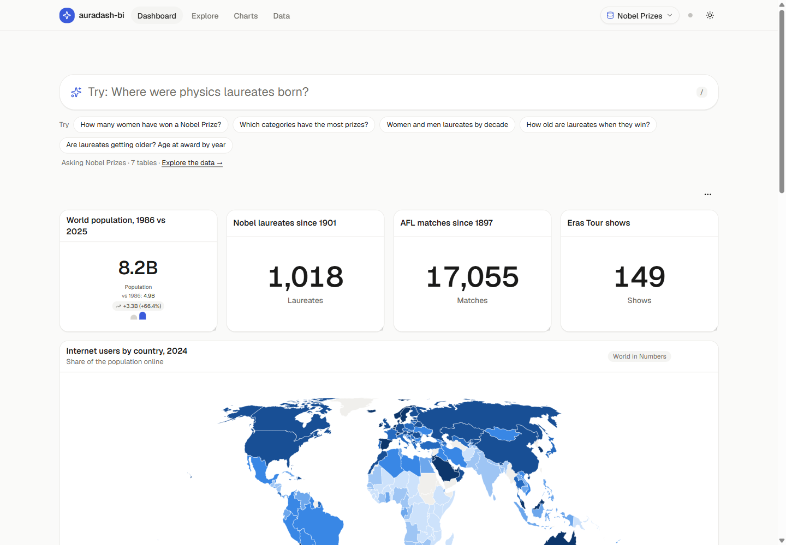

# auradash-bi

**Ask your data. Get the chart.** Type a question in plain English. auradash-bi works out the SQL, runs it in your browser and picks the chart that fits the answer. Pin what you like to a dashboard you can drag and resize.

**Live demo: [auradash-bi.everadapt.au](https://auradash-bi.everadapt.au)**



## How it works

The language model never writes SQL. Code turns the schema into options, [Jev](https://typesafe.ai) (TypeSafe AI's System One model) picks typed answers, and code does the rest:

```
question ─► Jev picks: measure · group by · time · filters · top N
         ─► code compiles parameterised SQL (joins from foreign keys)
         ─► SQLite (WebAssembly) runs it in your browser
         ─► Jev picks the chart among the ones that fit ─► pin it
```

- **Four datasets to try:** Nobel Prizes, World in Numbers (World Bank), AFL (every match since 1897) and Taylor Swift.
- **Bring your own data:** `.sqlite`, `.sql` dumps (SQLite, MySQL, Postgres) or `.csv`. It never leaves your browser. This is switched off on the public demo.
- **Explore:** a table browser, schema and relationship views, and a read-only SQL console.
- **16 chart types**, a drag-and-resize dashboard, light and dark themes, and an offline planner when no API key is set.

## Run it

```bash
bun install
cp .dev.vars.example .dev.vars   # optional: add a TYPESAFE_API_KEY
bun run dev                      # http://localhost:5310
```

`bun run build` builds the app and the Worker. `bun run deploy` deploys it to Cloudflare Workers. [AGENTS.md](AGENTS.md) covers everything else: architecture, datasets, scripts and conventions.

## Stack

Vite, React 19, TypeScript, Tailwind CSS v4, shadcn/ui, Recharts, CodeMirror, SQLite WASM, Hono on Cloudflare Workers, and TypeSafe Jev.

## Data and credits

- **Nobel Prizes:** Nobel Prize Outreach (CC0). Not endorsed by Nobel Prize Outreach.
- **World in Numbers:** World Bank World Development Indicators (CC BY 4.0).
- **AFL:** match data from the [Squiggle API](https://api.squiggle.com.au).
- **Taylor Swift:** MusicBrainz and Wikidata (CC0), and Wikipedia (CC BY-SA 4.0). It contains no lyrics.
- **Maps:** Natural Earth.
- **Inspiration:** [shapeshift](https://github.com/anishfn/shapeshift) (MIT).

## License

The code is MIT licensed ([LICENSE](LICENSE)). The datasets keep their own licences.

Made by [Diego Oliveira](https://www.linkedin.com/in/diego-oliveira-aba597b9/) at EverAdapt.
